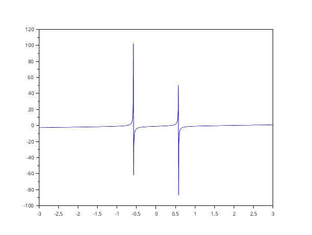
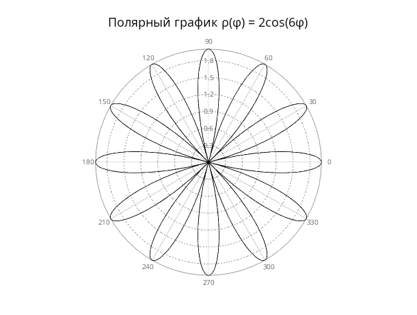
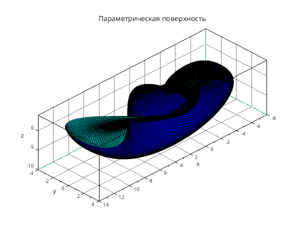
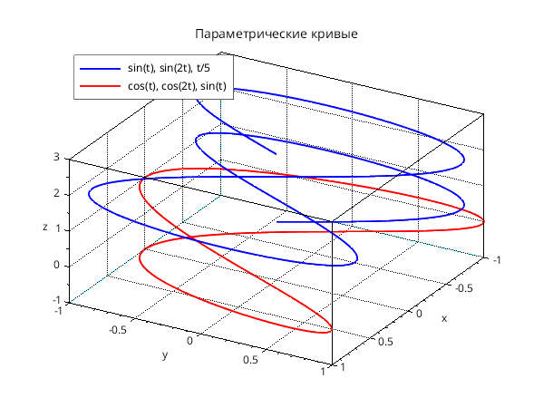
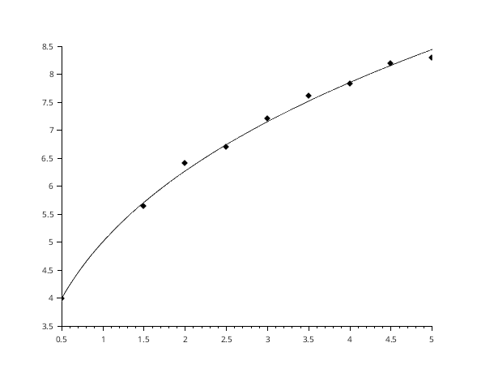

## Задание 1.1. Решение системы линейных алгебраических уравнений

### Условие
Решить систему линейных алгебраических уравнений и сделать проверку:

$$
\begin{cases}
x_1 - 2x_2 + 3x_3 - 2x_4 = -6 \\
x_1 + x_2 - 2x_3 - 3x_4 = -8 \\
3x_1 - 2x_2 - x_3 + 2x_4 = 4 \\
2x_1 + 3x_2 + 2x_3 + x_4 = 8
\end{cases}
$$

### Код программы

```scilab
A = [
     1, -2,  3, -2;
     1,  1, -2, -3;
     3, -2, -1,  2;
     2,  3,  2,  1
];

b = [-6; -8; 4; 8];

x = linsolve(A, -b);
disp(x)

check = A * x;
disp(check)
```

### Результаты выполнения

```
--> exec('/bin/1.1.sci', -1)

Решение системы:
   0.3750000
   1.1319444
   0.5138889
   2.8263889

Проверка (A * x):
  -6.0000000
  -8.0000000
   4.0000000
   8.0000000
```

### Вывод
Система решена верно — результаты проверки совпадают с исходными значениями вектора **b**.

---

## Задание 1.2. Вычисление обратной матрицы

### Условие
Если возможно, вычислить матрицу, обратную к матрице **D**:

$$D = 3A - (A + 2B)B^2$$

где:
$$
A = \begin{pmatrix}
4 & 5 & -2 \\
3 & -1 & 0 \\
4 & 2 & 7
\end{pmatrix}, \quad
B = \begin{pmatrix}
2 & 1 & -1 \\
0 & 1 & 3 \\
5 & 7 & 3
\end{pmatrix}
$$

### Код программы

```scilab
A = [4, 5, -2;
     3, -1, 0;
     4, 2, 7];

B = [2, 1, -1;
     0, 1, 3;
     5, 7, 3];

D = 3*A - (A + 2*B) * B^2;

det_D = det(D);

if abs(det_D) < 1e-10 then
    disp("Матрица D вырождена — обратной не существует.");
else
    disp("Определитель D:");
    disp(det_D);
    
    disp("Обратная матрица inv(D):");
    inv_D = inv(D);
    disp(inv_D);
end
```

### Результаты выполнения

```
--> exec('/bin/1.2.sci', -1)

"Определитель D:"
   13988.000

"Обратная матрица inv(D):"
  -0.9591078  -0.5         0.1133829
   0.8921933   0.5        -0.1171004
  -0.2660852  -0.1923077   0.0471833
```

### Вывод
Определитель матрицы **D** равен **13988** (≠ 0), следовательно, матрица невырожденная и обратная матрица существует.

---

## Задание 2.1. График функции в декартовых координатах

### Условие
Изобразите график функции:

$$f(x) = \frac{1.9x^3 - 2.8x^2 - 1.9x + 1}{3x^2 - 1}$$

### Код программы

```scilab
function y = f(x)
    y = (1.9*x.^3 - 2.8*x.^2 - 1.9*x + 1) ./ (3*x.^2 - 1);
endfunction

x = linspace(-3, 3, 1000);
y = f(x);

clf();
plot(x, y);
xtitle("График функции f(x)", "x", "f(x)");
xgrid();
```

### Результат


---

## Задание 2.2. График функции в полярных координатах

### Условие
Изобразите график функции в полярных координатах:

$$\rho(\phi) = 2\cos(6\phi)$$

### Код программы

```scilab
clf;
phi = linspace(0, 2*%pi, 1000);
rho = 2 * cos(6 * phi);
polarplot(phi, rho);
title('Полярный график ρ(φ) = 2cos(6φ)', 'FontSize', 4);
```

### Результат


### Вывод
Получена роза с 12 лепестками (так как коэффициент при φ чётный).

---

## Задание 3.1. Построение параметрической поверхности

### Условие
Построить график системы при помощи `plot3d2`:

$$
\begin{cases}
x = \cos(u) \cdot u \cdot \left(1+\cos\left(\frac{v}{2}\right)\right) \\
y = \frac{u}{2} \cdot \sin(v) \\
z = \sin(u) \cdot u \cdot \left(1 + \cos\left(\frac{v}{2}\right)\right)
\end{cases}
$$

$$0 \leq u \leq 2\pi, \quad 0 \leq v \leq 8\pi$$

### Код программы

```scilab
u = linspace(0, 2*%pi, 200);
v = linspace(0, 8*%pi, 200);

[U,V] = ndgrid(u,v);

X = cos(U) .* U .* (1 + cos(V/2));
Y = U/2 .* sin(V);
Z = sin(U) .* U .* (1 + cos(V/2));

clf();
plot3d2(X, Y, Z);
xtitle("Параметрическая поверхность", "x", "y", "z");
xgrid();
colorbar();
```

### Результат


---

## Задание 3.2. Параметрические кривые в 3D

### Условие
Изобразить линии, заданные параметрически с помощью функции `param3d`:

**Кривая 1:**
$$
\begin{cases}
x(t) = \sin(t) \\
y(t) = \sin(2t) \\
z(t) = \frac{t}{5}
\end{cases}
$$

**Кривая 2:**
$$
\begin{cases}
x(t) = \cos(t) \\
y(t) = \cos(2t) \\
z(t) = \sin(t)
\end{cases}
$$

### Код программы

```scilab
t = linspace(%pi, 4*%pi, 500);

x1 = sin(t);
y1 = sin(2*t);
z1 = t/5;

x2 = cos(t);
y2 = cos(2*t);
z2 = sin(t);

clf();

param3d(x1, y1, z1, alpha=30, theta=30);
e1 = gce();
e1.line_mode = "on";
e1.foreground = color("blue");
e1.thickness = 2;

param3d(x2, y2, z2, alpha=30, theta=30);
e2 = gce();
e2.line_mode = "on";
e2.foreground = color("red");
e2.thickness = 2;

a = gca();
a.box = "on";
a.grid = [1 1 1];
a.labels_font_size = 2;
a.title.font_size = 3;
xtitle("Параметрические кривые", "x", "y", "z");

legend(["sin(t), sin(2t), t/5"; "cos(t), cos(2t), sin(t)"], "in_upper_left");
```

### Результат


---

## Задание 4.1. Нахождение корней полиномов

### Условие
Найти корни полиномов:
1. $P_1(x) = 2x^4 - x - 1.5$
2. $P_2(x) = 3x^3 - 5x^2 + 9x - 10$

### Код программы

```scilab
r1 = roots([2, 0, 0, -1, -1.5]);
disp("Корни первого полинома: ");
disp(r1);

r2 = roots([3, -5, 9, -10]);
disp("Корни второго полинома: ");
disp(r2);
```

### Результаты выполнения

```
--> exec('/bin/4.1.sci', -1)

"Корни первого полинома: "
   1.064083  + 0.i       
  -0.1441716 + 0.9422356i
  -0.1441716 - 0.9422356i
  -0.7757399 + 0.i       

"Корни второго полинома: "
   0.1763009 + 1.5829012i
   0.1763009 - 1.5829012i
   1.3140648 + 0.i
```

### Вывод
- Первый полином имеет **2 действительных** и **2 комплексно-сопряжённых** корня
- Второй полином имеет **1 действительный** и **2 комплексно-сопряжённых** корня

---

## Задание 5.1. Метод наименьших квадратов

### Условие
В результате эксперимента была определена табличная зависимость:

| s | 0.5 | 1.5 | 2 | 2.5 | 3 | 3.5 | 4 | 4.5 | 5 |
|---|-----|-----|---|-----|---|-----|---|-----|---|
| G | 3.99 | 5.65 | 6.41 | 6.71 | 7.215 | 7.611 | 7.83 | 8.19 | 8.3 |

С помощью метода наименьших квадратов определить линию регрессии вида:

$$G(s) = A \cdot s^b$$

Рассчитать коэффициент корреляции и суммарную ошибку.

### Код программы

```scilab
s = [0.5 1.5 2 2.5 3 3.5 4 4.5 5];
G = [3.99 5.65 6.41 6.71 7.215 7.611 7.83 8.19 8.3];

X = log(s);
Y = log(G);

function [zr]=F(c, z)
    zr = z(2,:) - (c(2)*z(1,:) + c(1));
endfunction

data = [X;Y];
c0 = [0 0];

[a, err] = datafit(F, data, c0);

a0 = a(1);
b = a(2);
A = exp(a0);

disp("A = " + string(A));
disp("b = " + string(b));
disp("Суммарная ошибка = " + string(err));

Xavg = mean(X);
Yavg = mean(Y);

r = sum((X - Xavg).*(Y - Yavg)) / ...
    sqrt(sum((X - Xavg).^2) * sum((Y - Yavg).^2));

disp("Коэффициент корреляции = " + string(r));

clf();
plot2d(s, G, -4);

s2 = 0.5:0.01:5;
Gpred = A .* s2.^b;
plot2d(s2, Gpred);

legend(["Экспериментальные данные"; "Аппроксимация G=As^b"]);
xtitle("Аппроксимация методом наименьших квадратов", "s", "G");
xgrid();
```

### Результаты выполнения

```
--> exec('/bin/5.1.sci', -1)

"A = 5.0135575"
"b = 0.3242997"
"Суммарная ошибка = 0.0113163"
"Коэффициент корреляции = 0.9986642"
```


### Итоговая формула

$$\boxed{G(s) = 5.014 \cdot s^{0.324}}$$

### Вывод
- Коэффициент корреляции **r = 0.9987** указывает на очень сильную связь между переменными
- Суммарная ошибка аппроксимации составляет **0.0113**, что свидетельствует о хорошем качестве подбора функции

