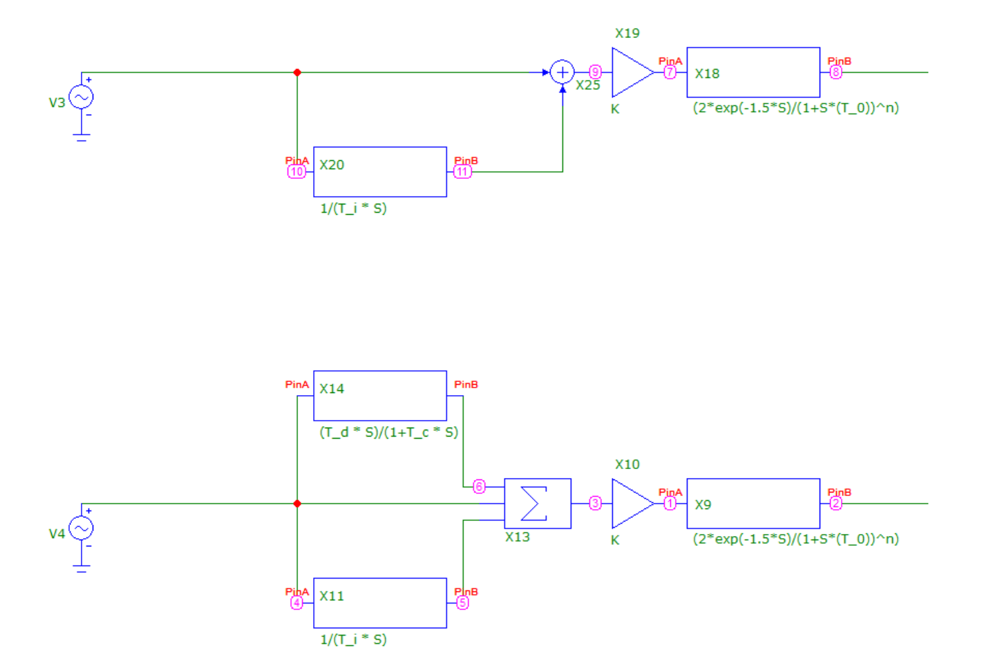
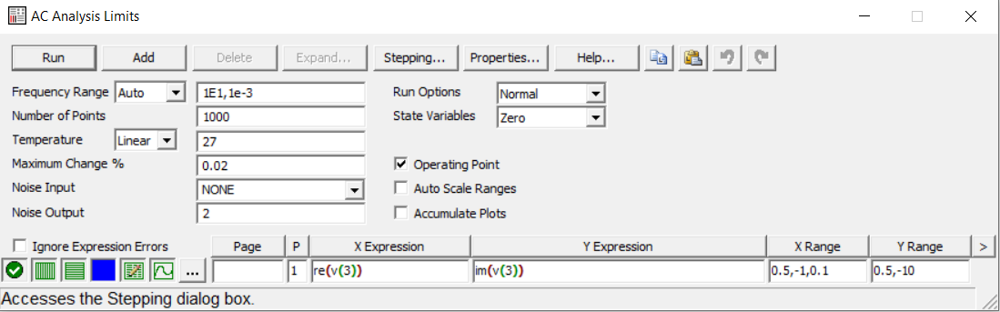
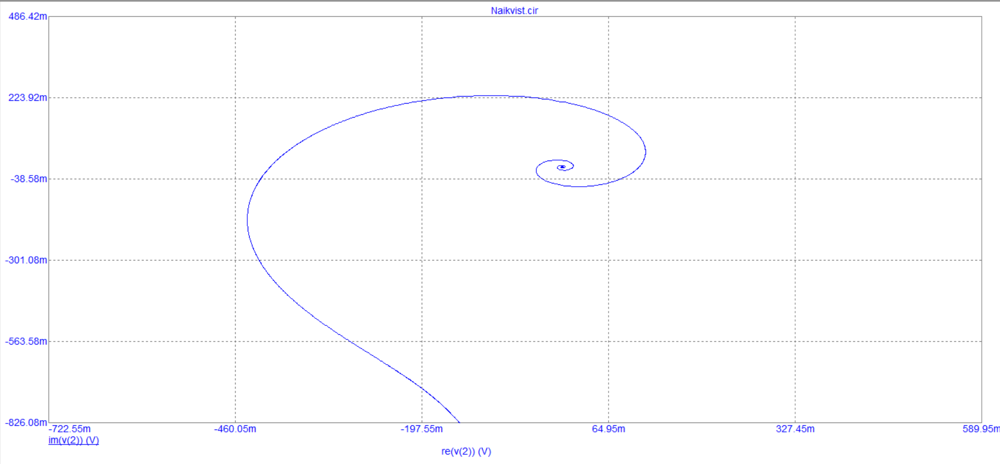
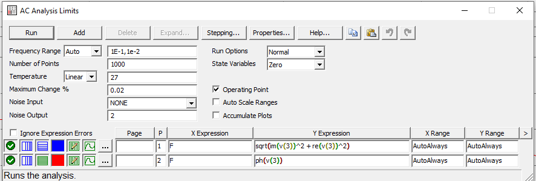
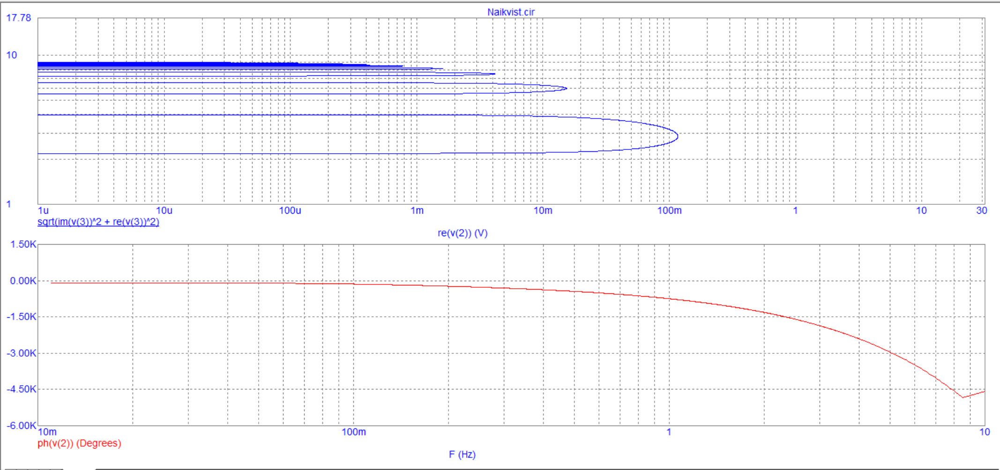

1) Исследовать запас устойчивости ПИ- и ПИД-регуляторов, настроенных для 10.2. Источник заменить на `sine source`, разомкнуть обратную связь.  
2) Построить годограф Найквиста (`Analysis > AC`)  
3) Вычислить по годографу Найквиста запасы устойчивости по амплитуде и фазе для каждого из регуляторов  
4) Сравнить запасы устойчивости ПИ- и ПИД-регуляторов  
5) Построить годограф Найквиста в виде двух диаграмм Боде зависимостей амплитуды и фазы годографа от частоты  
6) Включить в свойствах графика числовой вывод диаграмм Боде и по полученным массивам определить запасы устойчивости по амплитуде и фазе

## 1. Изменение регуляторов
Видоизменены схемы ПИ- и ПИД-регуляторов, настроенных при выполнении лабораторной работы 10.2: источник постоянного тока заменён на источник переменного тока `sine source`, обратная связь разомкнута.



## 2. Построение годографа
Годограф Найквиста построен через меню `Analysis > AC`.




## 3. Определение запасов устойчивости
Запас устойчивости по амплитуде определяется по значению модуля разомкнутой системы при фазе `-180°`:

\[
K_a = 20 \lg \frac{1}{a}
\]

где \(a\) — модуль годографа в точке, где фаза равна `-180°`.

Запас устойчивости по фазе определяется по фазе разомкнутой системы в точке, где модуль равен 1:

\[
\Delta \varphi = 180^\circ - |\varphi|
\]

где \(\varphi\) — фаза при \(|W(j\omega)| = 1\).

Считается, что система имеет достаточный запас устойчивости:
- по амплитуде, если \(K_a \ge 3\) дБ;
- по фазе, если \(\Delta \varphi \ge 30^\circ\).

## 4. Сравнение запасов устойчивости
По полученным данным запасы устойчивости ПИ- и ПИД-регуляторов составили:

| Схема | Запас устойчивости по фазе, ° | Запас устойчивости по амплитуде, дБ |
| ----- | -----------------------------: | ----------------------------------: |
| ПИ    | 69.5                           | 6.957                               |
| ПИД   | 85.49                          | 8.068                               |

Из таблицы видно, что оба регулятора обладают достаточным запасом устойчивости, так как удовлетворяют условиям \(K_a \ge 3\) дБ и \(\Delta \varphi \ge 30^\circ\).  
При этом ПИД-регулятор имеет больший запас устойчивости как по амплитуде, так и по фазе.

## 5. Построение годографа в виде двух диаграмм Боде
Годограф Найквиста представлен в виде двух диаграмм Боде: зависимости фазы и модуля от частоты.




Для вывода модуля использовано выражение:

```text
sqrt(im(v(12))^2 + re(v(12))^2)
```

Для вывода фазы использовано выражение:

```text
ph(v(12))
```

Здесь:
- `ph(v(12))` — фаза комплексной передаточной функции;
- `sqrt(im(v(12))^2 + re(v(12))^2)` — модуль комплексной передаточной функции.

## 6. Определение запасов устойчивости по числовым данным диаграмм Боде

### ПИ-регулятор
По числовым данным диаграмм Боде получены следующие значения:

| `ph(v(12))`        | `sqrt(im(v(12))^2 + re(v(12))^2)` |
| ------------------ | ---------------------------------: |
| `-1.817E+02` ~ -180 | 4.898E-01                          |
| `-1.105E+02`        | 1.014E+00 ~ 1                      |

Запас устойчивости по амплитуде определяем по точке, где фаза близка к `-180°`:

\[
K_a = 20 \lg \frac{1}{0.4489} = 6.957 \text{ дБ}
\]

Запас устойчивости по фазе определяем по точке, где модуль близок к 1:

\[
\Delta \varphi = 180^\circ - 110.5^\circ = 69.5^\circ
\]

### ПИД-регулятор
По числовым данным диаграмм Боде получены следующие значения:

| `ph(v(12))`       | `sqrt(im(v(12))^2 + re(v(12))^2)` |
| ----------------- | ---------------------------------: |
| `-1.871E+02` ~ -180 | 3.953E-01                        |
| `-9.451E+01`       | 1.099E+00 ~ 1                     |

Запас устойчивости по амплитуде определяем по точке, где фаза близка к `-180°`:

\[
K_a = 20 \lg \frac{1}{0.3953} = 8.068 \text{ дБ}
\]

Запас устойчивости по фазе определяем по точке, где модуль близок к 1:

\[
\Delta \varphi = 180^\circ - 94.51^\circ = 85.49^\circ
\]

## Вывод
В ходе работы были исследованы запасы устойчивости ПИ- и ПИД-регуляторов по годографу Найквиста и диаграммам Боде.

Для ПИ-регулятора:
- запас устойчивости по амплитуде составил `6.957 дБ`;
- запас устойчивости по фазе составил `69.5°`.

Для ПИД-регулятора:
- запас устойчивости по амплитуде составил `8.068 дБ`;
- запас устойчивости по фазе составил `85.49°`.

Оба регулятора обладают достаточным запасом устойчивости.  
ПИД-регулятор показывает лучшие показатели устойчивости по сравнению с ПИ-регулятором как по амплитуде, так и по фазе.
