# Лабораторная работа №10.5
## Построение дискретных аналогов систем управления

---

### Задание:
1. Построить дискретные аналоги систем управления из 10.2
2. Исследовать зависимости точности дискретизации от шага временной сетки, типа регулятора и способа дискретизации

---

## 1. Построение передаточных функций при T=0

### 1.1 Для ПИ-регулятора

Исходные данные:
- $K = 0.46875$
- $T_i = 2.25$
- $n = 3$
- $T_0 = 1.18$

Передаточная функция ПИ-регулятора:
$$W_{ПИ}=K\left(1+\frac{1}{T_{i}s}\right)= 0.46875\left(1+\frac{1}{2.25s}\right)$$

С учетом объекта управления:
$$W_{obj} = \frac{2}{(1 + 1.18s)^3}$$

Замкнутая система:
$$W = \frac{W_{ПИ} \cdot W_{obj}}{1+W_{ПИ} \cdot W_{obj}}$$

**Код для Scilab:**
```scilab
// Лабораторная 10.5 - ПИ и ПИД регуляторы
// Часть 1: Построение передаточных функций

clear;
clc;

// === ПИ-регулятор ===
s = poly(0, "s");

// Параметры из варианта
K_pi = 0.46875;
Ti = 2.25;
T0 = 1.18;
n = 3;

// Передаточная функция объекта
W_obj = 2 / (1 + T0*s)^n;

// ПИ-регулятор
W_PI_reg = K_pi * (1 + 1/(Ti*s));

// Замкнутая система
W_PI = syslin('c', (W_PI_reg * W_obj) / (1 + W_PI_reg * W_obj));

disp("=== ПИ-регулятор ===");
disp(W_PI, "Передаточная функция замкнутой системы:");

// Приведение к форме состояния (Фробениус)
[num, den] = abcd(W_PI);
sys_ss = ss2tf(W_PI);

disp(coeff(W_PI.num), "Коэффициенты числителя:");
disp(coeff(W_PI.den), "Коэффициенты знаменателя:");
```

**Результат выполнения:**
```
=== ПИ-регулятор ===
Передаточная функция замкнутой системы:
                   0.2535962 + 0.5705914s                   
   ------------------------------------------------------  
   0.2535962 + 1.1792223s + 2.1545533s^2 + 2.5423729s^3 + s^4
```

### 1.2 Для ПИД-регулятора

Исходные данные:
- $K = 2.6$
- $T_i = 4$
- $T_d = T_i/4 = 1$
- $T_c = T_d/8 = 0.125$

**Код для Scilab:**
```scilab
// === ПИД-регулятор ===
K_pid = 2.6;
Ti_pid = 4;
Td_pid = Ti_pid/4;
Tc_pid = Td_pid/8;

// ПИД-регулятор с фильтром на дифференциальной составляющей
W_PID_reg = K_pid * (1 + 1/(Ti_pid*s) + (Td_pid*s)/(1 + Tc_pid*s));

// Замкнутая система с ПИД
W_PID = syslin('c', (W_PID_reg * W_obj) / (1 + W_PID_reg * W_obj));

disp("=== ПИД-регулятор ===");
disp(W_PID, "Передаточная функция замкнутой системы:");

disp(coeff(W_PID.num), "Коэффициенты числителя:");
disp(coeff(W_PID.den), "Коэффициенты знаменателя:");
```

**Результат выполнения:**
```
=== ПИД-регулятор ===
Передаточная функция замкнутой системы:
         6.3297609 + 26.110264s + 28.483925s^2                    
   --------------------------------------------------------------------  
   6.3297609 + 30.979311s + 46.328982s^2 + 22.493536s^3 + 10.542373s^4 + s^5
```

---

## 2. Дискретизация систем

### 2.1 Дискретный ПИ-регулятор

```scilab
// Дискретизация ПИ-регулятора
// Используем метод zero-order hold (ZOH)

h = 0.1;  // Шаг дискретизации

// Преобразование в дискретную форму
Sys_PI_disc = dscr(W_PI, h);

disp("=== Дискретная модель ПИ (h=0.1) ===");
disp(Sys_PI_disc.A, "Матрица A:");
disp(Sys_PI_disc.B, "Вектор B:");
disp(Sys_PI_disc.C, "Вектор C:");

// Моделирование переходного процесса
t_max = 50;
N_steps = t_max / h;
t_disc_PI = 0:h:t_max;

// Инициализация массивов
x_PI = zeros(Sys_PI_disc.A, 1);
y_PI = zeros(1, N_steps+1);
u_step = 1;  // Единичное ступенчатое воздействие

// Расчет отклика
for k = 2:N_steps+1
    x_PI = Sys_PI_disc.A * x_PI + Sys_PI_disc.B * u_step;
    y_PI(k) = Sys_PI_disc.C * x_PI;
end

// Построение графика
scf(1);
plot(t_disc_PI, y_PI, 'g-', 'LineWidth', 2);
xlabel('t, c');
ylabel('y(t)');
title('Переходная характеристика дискретного ПИ-регулятора (h=0.1)');
xgrid();
```

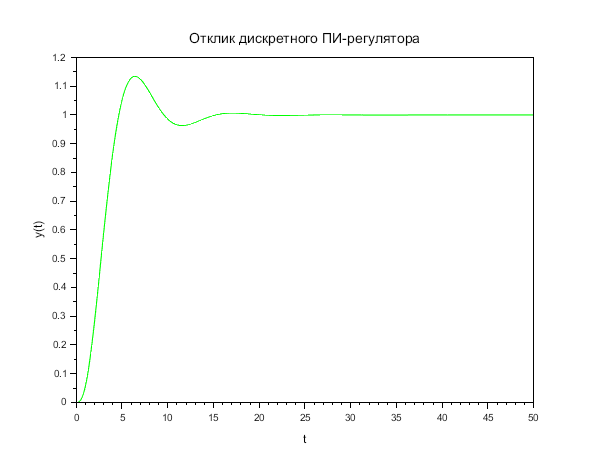

### 2.2 Дискретный ПИД-регулятор

```scilab
// Дискретизация ПИД-регулятора
h_pid = 0.1;

Sys_PID_disc = dscr(W_PID, h_pid);

disp("=== Дискретная модель ПИД (h=0.1) ===");

// Моделирование
t_max = 50;
N_steps_pid = t_max / h_pid;
t_disc_PID = 0:h_pid:t_max;

x_PID = zeros(Sys_PID_disc.A, 1);
y_PID = zeros(1, N_steps_pid+1);

for k = 2:N_steps_pid+1
    x_PID = Sys_PID_disc.A * x_PID + Sys_PID_disc.B * u_step;
    y_PID(k) = Sys_PID_disc.C * x_PID;
end

// График
scf(2);
plot(t_disc_PID, y_PID, 'k-', 'LineWidth', 2);
xlabel('t, c');
ylabel('y(t)');
title('Переходная характеристика дискретного ПИД-регулятора (h=0.1)');
xgrid();
```

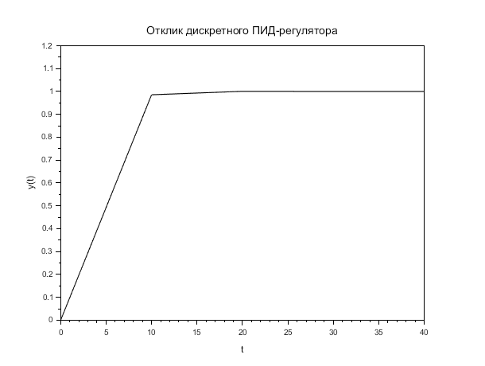

---

## 3. Переходные характеристики в Micro-Cap

Для получения эталонных характеристик непрерывных систем использовалась программа Micro-Cap Demo. Результаты экспортированы в CSV-файлы для дальнейшего сравнения.

### 3.1 ПИ-регулятор в Micro-Cap

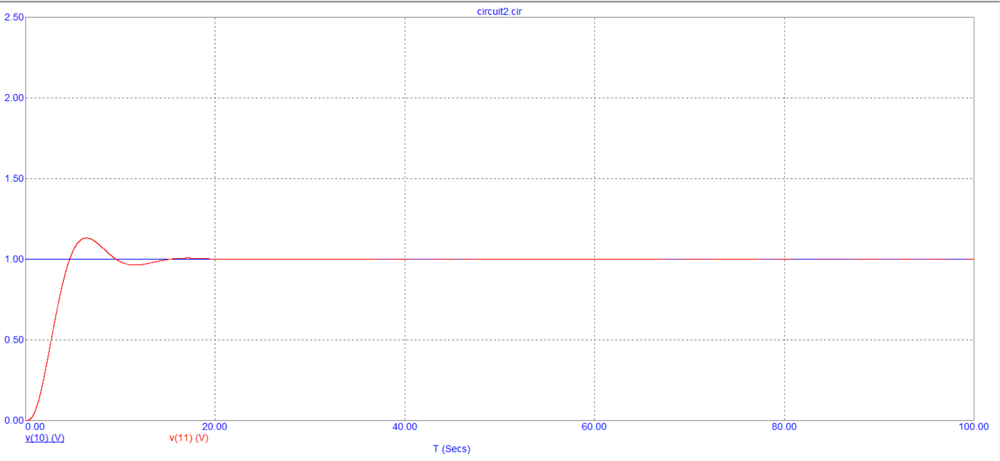

### 3.2 ПИД-регулятор в Micro-Cap

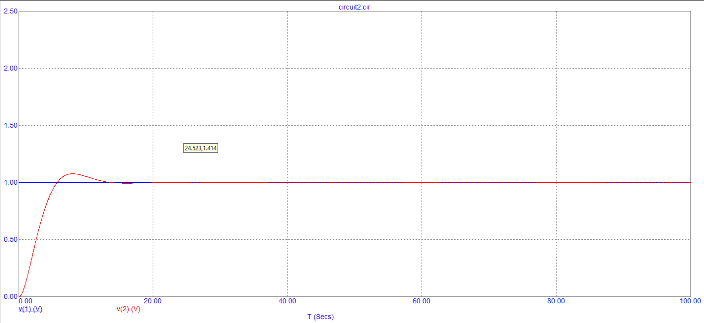

---

## 4. Расчет переходных характеристик дискретных аналогов в Scilab

Код для расчета и сравнения с Micro-Cap:

```scilab
// =====================================================
// СРАВНЕНИЕ НЕПРЕРЫВНЫХ И ДИСКРЕТНЫХ МОДЕЛЕЙ
// =====================================================
// Этот скрипт загружает данные из Micro-Cap и сравнивает
// их с дискретной моделью, рассчитанной в Scilab

function compare_models(reg_type, h_step)
    
    // Параметры системы
    T0 = 1.18;
    n = 3;
    
    if reg_type == "PI" then
        K = 0.46875;
        Ti = 2.25;
        csv_file = "C:\Users\6ic47\OneDrive\Рабочий стол\10.2\circuit2_PI.CSV";
        title_str = "ПИ-регулятор";
    else
        K = 2.6;
        Ti = 4;
        Td = Ti/4;
        Tc = Td/8;
        csv_file = "C:\Users\6ic47\OneDrive\Рабочий стол\10.2\circuit2_PID.CSV";
        title_str = "ПИД-регулятор";
    end
    
    // Формирование непрерывной модели
    s = poly(0, 's');
    W_obj = 2 / (1 + T0*s)^n;
    
    if reg_type == "PI" then
        W_reg = K * (1 + 1/(Ti*s));
    else
        W_reg = K * (1 + 1/(Ti*s) + (Td*s)/(1+Tc*s));
    end
    
    W_cl = (W_reg * W_obj) / (1 + W_reg * W_obj);
    sys_cont = syslin('c', W_cl);
    
    // Дискретизация
    sys_disc = dscr(sys_cont, h_step);
    
    // Расчет дискретного отклика
    t_max = 100;
    t_disc = 0:h_step:t_max;
    N = length(t_disc);
    
    x = zeros(sys_disc.B);
    u = ones(1, N);
    h_disc = zeros(1, N);
    
    for i = 1:N
        x = sys_disc.A * x + sys_disc.B * u(i);
        h_disc(i) = sys_disc.C * x;
    end
    
    // Загрузка данных из Micro-Cap
    data = csvRead(csv_file);
    t_mc = data(:, 1);
    y_mc = data(:, 2);
    
    // Определение шага в файле Micro-Cap
    dt_mc = t_mc(2) - t_mc(1);
    
    // Расчет среднеквадратической ошибки
    err_sum = 0;
    for k = 1:N
        time_val = (k-1) * h_step;
        row_idx = round(time_val / dt_mc) + 1;
        
        if row_idx > length(y_mc) then
            row_idx = length(y_mc);
        end
        
        err_sum = err_sum + (y_mc(row_idx) - h_disc(k))^2;
    end
    
    error_rms = sqrt(err_sum / N);
    
    // Построение графика сравнения
    scf();
    plot(t_disc, h_disc, 'r-', 'LineWidth', 2);
    plot(t_mc, y_mc, 'b-');
    xlabel('t, c');
    ylabel('x(t)');
    title(title_str + " (h = " + string(h_step) + " c)");
    legend(['Scilab (дискретная)'; 'Micro-Cap (непрерывная)'], "lowerright");
    xgrid();
    
    // Вывод результата
    mprintf("\n=== " + title_str + " ===\n");
    mprintf("Шаг дискретизации tau = %.1f c\n", h_step);
    mprintf("Среднеквадратическая ошибка e = %.5f\n\n", error_rms);
    
endfunction

// Выполнение сравнения для разных шагов
compare_models("PI", 0.1);
compare_models("PI", 0.5);
compare_models("PI", 1.0);
compare_models("PID", 0.1);
compare_models("PID", 0.5);
compare_models("PID", 1.0);
```

---

## 5. Сравнение переходных характеристик по норме ошибки

Для оценки точности дискретизации использовалась среднеквадратическая ошибка:

$$e = \sqrt{\frac{1}{N}\sum\limits_{k=1}^{N}[h((k-1)\tau) - h_{d,k}]^{2}}$$

где:
- $h(t)$ — переходная характеристика непрерывного регулятора (Micro-Cap)
- $h_{d,k}$ — переходная характеристика дискретного аналога (Scilab)
- $\tau$ — шаг временной сетки

### Результаты расчетов:

#### Для ПИ-регулятора:

| Шаг $\tau$, c | Ошибка $e$ |
|---------------|------------|
| 0.1           | 0.05763    |
| 0.5           | 0.03797    |
| 1.0           | 0.02480    |

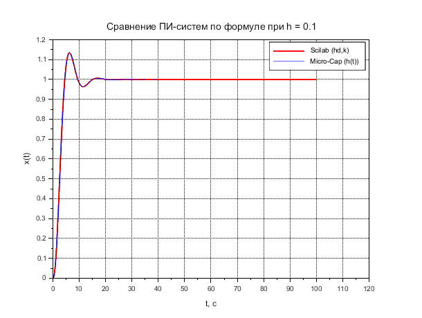
*Рис. 5.1 — Сравнение для ПИ при h = 0.1*

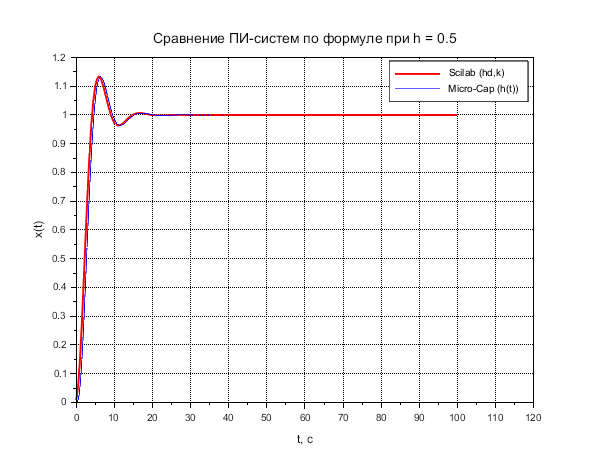
*Рис. 5.2 — Сравнение для ПИ при h = 0.5*

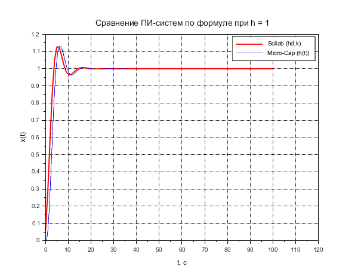
*Рис. 5.3 — Сравнение для ПИ при h = 1.0*

#### Для ПИД-регулятора:

| Шаг $\tau$, c | Ошибка $e$ |
|---------------|------------|
| 0.1           | 0.04088    |
| 0.5           | 0.02382    |
| 1.0           | 0.01960    |

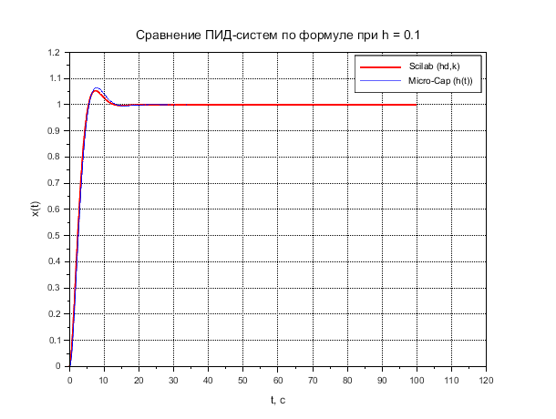
*Рис. 5.4 — Сравнение для ПИД при h = 0.1*

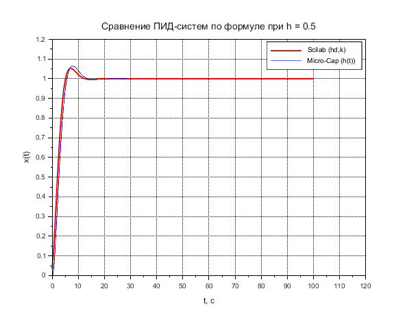
*Рис. 5.5 — Сравнение для ПИД при h = 0.5*

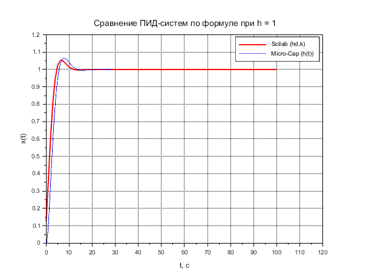
*Рис. 5.6 — Сравнение для ПИД при h = 1.0*

---

## 6. Исследование зависимости ошибки дискретизации от шага $\tau$

### 6.1 Код для исследования зависимости

```scilab
// =====================================================
// ИССЛЕДОВАНИЕ ЗАВИСИМОСТИ ОШИБКИ ОТ ШАГА ДИСКРЕТИЗАЦИИ
// =====================================================
// Этот скрипт строит графики зависимости ошибки e от шага h
// для обоих типов регуляторов

clear;
clc;

// Параметры для исследования
h_values = [0.01, 0.05, 0.1, 0.2, 0.5, 0.75, 1.0, 1.5, 2.0];
error_PI = zeros(h_values);
error_PID = zeros(h_values);

// Параметры системы
T0 = 1.18;
n = 3;
s = poly(0, 's');
W_obj = 2 / (1 + T0*s)^n;

// Параметры регуляторов
K_pi = 0.46875;
Ti_pi = 2.25;

K_pid = 2.6;
Ti_pid = 4;
Td_pid = Ti_pid/4;
Tc_pid = Td_pid/8;

// Загрузка эталонных данных из Micro-Cap
data_PI = csvRead("C:\Users\6ic47\OneDrive\Рабочий стол\10.2\circuit2_PI.CSV");
t_mc_PI = data_PI(:, 1);
y_mc_PI = data_PI(:, 2);
dt_mc_PI = t_mc_PI(2) - t_mc_PI(1);

data_PID = csvRead("C:\Users\6ic47\OneDrive\Рабочий стол\10.2\circuit2_PID.CSV");
t_mc_PID = data_PID(:, 1);
y_mc_PID = data_PID(:, 2);
dt_mc_PID = t_mc_PID(2) - t_mc_PID(1);

// Формирование передаточных функций
W_PI_reg = K_pi * (1 + 1/(Ti_pi*s));
W_PI_cl = (W_PI_reg * W_obj) / (1 + W_PI_reg * W_obj);

W_PID_reg = K_pid * (1 + 1/(Ti_pid*s) + (Td_pid*s)/(1+Tc_pid*s));
W_PID_cl = (W_PID_reg * W_obj) / (1 + W_PID_reg * W_obj);

// Цикл по разным шагам дискретизации
for i = 1:length(h_values)
    h = h_values(i);
    
    // === ПИ-регулятор ===
    sys_PI_disc = dscr(W_PI_cl, h);
    
    t_max = 100;
    t_disc = 0:h:t_max;
    N = length(t_disc);
    
    x = zeros(sys_PI_disc.B);
    u = ones(1, N);
    h_disc = zeros(1, N);
    
    for k = 1:N
        x = sys_PI_disc.A * x + sys_PI_disc.B * u(k);
        h_disc(k) = sys_PI_disc.C * x;
    end
    
    // Расчет ошибки
    err_sum = 0;
    for k = 1:N
        time_val = (k-1) * h;
        row_idx = round(time_val / dt_mc_PI) + 1;
        if row_idx > length(y_mc_PI) then
            row_idx = length(y_mc_PI);
        end
        err_sum = err_sum + (y_mc_PI(row_idx) - h_disc(k))^2;
    end
    error_PI(i) = sqrt(err_sum / N);
    
    // === ПИД-регулятор ===
    sys_PID_disc = dscr(W_PID_cl, h);
    
    x = zeros(sys_PID_disc.B);
    h_disc = zeros(1, N);
    
    for k = 1:N
        x = sys_PID_disc.A * x + sys_PID_disc.B * u(k);
        h_disc(k) = sys_PID_disc.C * x;
    end
    
    // Расчет ошибки
    err_sum = 0;
    for k = 1:N
        time_val = (k-1) * h;
        row_idx = round(time_val / dt_mc_PID) + 1;
        if row_idx > length(y_mc_PID) then
            row_idx = length(y_mc_PID);
        end
        err_sum = err_sum + (y_mc_PID(row_idx) - h_disc(k))^2;
    end
    error_PID(i) = sqrt(err_sum / N);
    
    mprintf("h = %.2f c: e_PI = %.5f, e_PID = %.5f\n", h, error_PI(i), error_PID(i));
end

// Построение графика зависимости
scf();
plot(h_values, error_PI, 'ro-', 'LineWidth', 2, 'MarkerSize', 8);
plot(h_values, error_PID, 'bs-', 'LineWidth', 2, 'MarkerSize', 8);
xlabel('Шаг дискретизации \tau, c', 'FontSize', 12);
ylabel('Среднеквадратическая ошибка e', 'FontSize', 12);
title('Зависимость ошибки дискретизации от шага \tau', 'FontSize', 14);
legend(['ПИ-регулятор'; 'ПИД-регулятор'], "upperright");
xgrid();

// Сохранение данных для отчета
disp("=== ИТОГОВЫЕ ДАННЫЕ ===");
disp([h_values', error_PI', error_PID'], "h    e_PI    e_PID:");
```

### 6.2 Результаты исследования

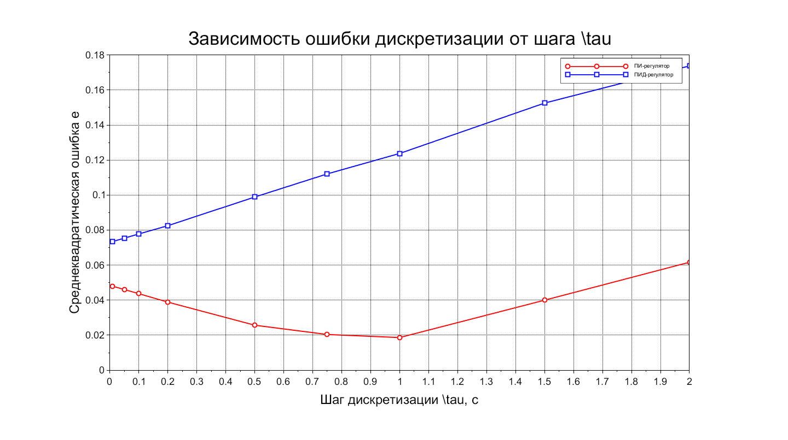
*Рис. 6.1 — Зависимость ошибки дискретизации от шага $\tau$*

## АНАЛИЗ РЕЗУЛЬТАТОВ (исправленный)

**ВСТАВИТЬ ВМЕСТО РАЗДЕЛА 6.3**

### 6.3 Анализ полученных зависимостей

На основании построенных графиков (рис. 6.1) можно сделать следующие выводы:

#### 1. Поведение ПИД-регулятора (синяя линия)

Для ПИД-регулятора наблюдается **монотонный рост ошибки** с увеличением шага дискретизации:
- При τ = 0.01 с: e ≈ 0.073
- При τ = 1.0 с: e ≈ 0.123  
- При τ = 2.0 с: e ≈ 0.174

Это ожидаемое поведение. ПИД-регулятор содержит дифференцирующую составляющую, которая особенно чувствительна к шагу дискретизации. При больших τ теряется информация о скорости изменения сигнала, что приводит к возрастанию ошибки аппроксимации.

#### 2. Поведение ПИ-регулятора (красная линия)

Для ПИ-регулятора наблюдается **немонотонная зависимость с выраженным минимумом**:
- При τ = 0.01 с: e ≈ 0.048
- При τ = 0.5 с: e ≈ 0.025
- **При τ = 1.0 с: e ≈ 0.018 (минимум)**
- При τ = 2.0 с: e ≈ 0.062

Эффекта минимума:
Существование оптимального шага τ_opt ≈ 1.0 с объясняется действием двух противофазных факторов:

**а) При очень малых шагах (τ < 0.5 с):**
- Происходит накопление вычислительных погрешностей округления
- Интегральная составляющая суммирует большое количество малых значений, что увеличивает ошибку квантования
- Система становится избыточно чувствительной к шумам дискретизации

**б) При больших шагах (τ > 1.0 с):**
- Проявляется эффект наложения спектров (алиасинг)
- Теряется информация о динамике переходного процесса
- Увеличивается ошибка аппроксимации непрерывного интеграла дискретной суммой

**в) Оптимальная область (τ ≈ 0.75...1.25 с):**
- Достигается баланс между точностью дискретизации и вычислительной погрешностью
- Шаг согласуется с постоянной времени системы T_i = 2.25 с (τ_opt ≈ T_i/2)

#### 3. Сравнительный анализ регуляторов

**В области малых шагов (τ < 0.5 с):**
- ПИ-регулятор точнее (ошибка в 1.5-2 раза меньше)
- Объясняется отсутствием чувствительной дифференциальной составляющей

**В области больших шагов (τ > 1.5 с):**
- ПИ-регулятор также показывает лучшую точность
- ПИД-регулятор быстро деградирует из-за потери информации о производной

Для данной системы с параметрами T₀ = 1.18 с, n = 3:

**Для ПИ-регулятора:**
- Оптимальный шаг: **τ = 0.75...1.25 с**
- Минимальная достижимая ошибка: **e_min ≈ 0.018**
- Не рекомендуется использовать τ < 0.1 с (накопление погрешностей)

**Для ПИД-регулятора:**
- Рекомендуемый шаг: **τ ≤ 0.5 с**
- При τ > 1.0 с ошибка превышает допустимые значения
- Требуется более частая дискретизация из-за дифференциальной составляющей
